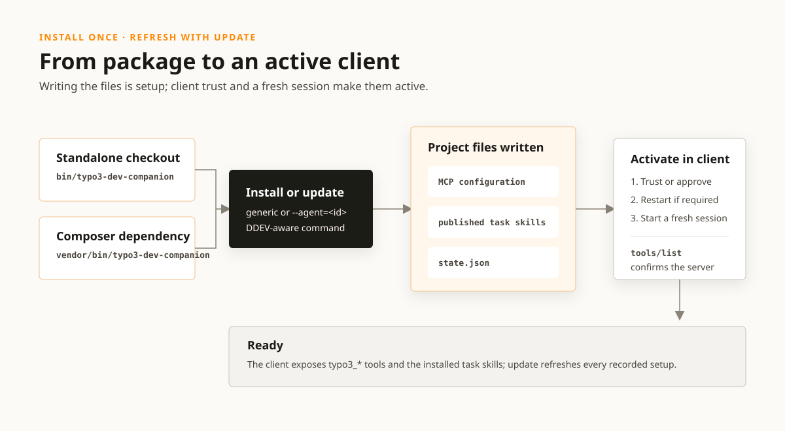

# Installing the server

Requirements: **PHP 8.2+** and Composer. The package works both ways — as a
standalone checkout and as a Composer dependency of another project. The
[readme](../../readme.md) has the short version; this page has the cases it
leaves out.



## Standalone

Clone the repository and install the dependencies once:

```bash
composer install
```

Then install the entrypoint into the current project's `.mcp.json`:

```bash
/absolute/path/to/typo3-dev-companion/bin/typo3-dev-companion install
```

For Codex, install its project configuration and task skills directly:

```bash
/absolute/path/to/typo3-dev-companion/bin/typo3-dev-companion install --agent=codex
```

Refresh them after updating this package:

```bash
/absolute/path/to/typo3-dev-companion/bin/typo3-dev-companion update
```

`update` takes `--agent=<client>` as well, but rarely needs to: `install`
records every client it set up in `.typo3-dev-companion/state.json`, and without
an agent `update` refreshes all of them. A project is usually worked on by more
than one, and which ones is knowledge only the project has.

## Being told that they are due

A published skill is a copy, so it goes stale without saying so: the client
loads the file it finds, the workflow reads as current whatever version wrote
it, and a tool name that has been renamed since fails at the call rather than at
the load. The record therefore carries a digest of what was published, and a
server started in that project compares it before the first call — `R-DIS-025`.

Where they no longer match, the server says so twice. The long line goes to
stderr, naming what differs and the command that fixes it, for whoever is at a
terminal. One short sentence goes into the instructions a client is handed at
initialize, for the agent that is about to load a skill; it is short because
that statement is budgeted and the exclusion prefix competes for the same room.

Three things make it speak: a skills directory that no longer holds what was
published there, a digest that no longer matches, and a record written before
the digest existed. The first is the one to expect — every published directory
ignores itself, which is also what `git clean -xdf` takes with it. A project
this package never installed into is silent.

Where the record carries drafts, the line says `update --drafts`: a run that
does not ask for them removes them, and somebody acting on the line wants the
project they have.

## Refreshing it when the package moves

The copy goes stale the moment this package moves, so a project can have the
thing that moved it run the refresh. Composer fires `post-update-cmd` after
`composer update`, and the project's own `composer.json` is where that is wired:

```json
{
    "scripts": {
        "post-update-cmd": [
            "typo3-dev-companion update"
        ]
    }
}
```

Nothing here writes that line. `install` and `update` write client
configuration, the skills and the record, and a file that decides what the
project consists of is not among them.

The command needs no path: Composer pushes the project's declared `bin-dir` onto
`PATH` before running a script, so the bare name resolves whether the project
puts its binaries in `vendor/bin` or in `.build/bin`. It runs in the project
root, which is where the record is.

A project where nothing is installed is told so and the run succeeds. That is
the ordinary case for everybody but the person who set it up: the record sits
below a directory that ignores itself, so it is in no checkout but theirs, and a
script that exits non-zero fails the whole Composer run.

What the hook does not cover is the fresh clone: `post-update-cmd` fires on
`composer update` and on an `install` with no lock file, so a colleague
installing from the lock runs nothing. There the notice at the next server start
is what says the copies are behind.

Add `--drafts` to that line where the project has drafts published in it. A run
that does not ask for them takes them out, and with the hook in place that
happens on every `composer update` rather than when somebody typed the command.

## Trying a draft where it is loaded

Both commands take `--drafts`, which publishes the skills that still declare
themselves drafts beside the ones this server publishes:

```bash
/absolute/path/to/typo3-dev-companion/bin/typo3-dev-companion install --agent=claude --drafts
```

What it is for is the review step [writing-a-skill.md](writing-a-skill.md) makes
a condition of publishing. Reading a draft in this repository is not reading it
where it loads, and the questions it exists to raise — is this the order the
work actually goes in, is the step that decides the outcome in it — are raised
by using it on a real task.

The drafts are recorded under their own key in
`.typo3-dev-companion/state.json`, because what is in a project unreviewed is
the question somebody opens that file to answer. They are the one thing an
`update` does not carry over: a run that does not ask for them removes them
again and says so. Sticky would be the convenient reading and the wrong one — an
unreviewed workflow that stays in a project because somebody once tried it is
what publishing being a deliberate edit exists to prevent.

Both commands write the client entry, because what belongs in it is a property
of the project rather than of the run: a project that required this package
after it was first installed, or that gained a DDEV configuration since, needs a
different entry than the one that is there, and `update` is what moves it. An
entry that starts something other than this server is somebody else's and is
refused instead — the two commands then say so and change nothing.

They own the command in that entry and nothing else. Whatever the caller put
beside it stays — `env` above all, which is the only place a client
configuration carries `TYPO3_DEV_COMPANION_EXCLUDE_TOOLS`. In a
`.codex/config.toml` or a `.grok/config.toml` that means every line of the
section this package does not write, so a value continued on the next line is
refused with the line number rather than rewritten around: keeping a line means
knowing where it ends.

Naming no client at all is a setup of its own, recorded as `generic`: `install`
then writes the `.mcp.json` entry and publishes the skills to `.agents/skills`,
the two locations a client finds without being configured for it. It is
refreshed by the same `update` as every named client. `--agent=` does not take
`generic`, because it is nobody's name.

Neither command touches the project's `.gitignore`. Every directory this package
writes — each published skill, and `.typo3-dev-companion/` where the record sits
— carries a `.gitignore` of its own that says `*`, which covers the directory
and that file with it: git reports nothing there, and a skill the project wrote
itself, in the same skills directory, stays visible. Merged agent or MCP
configuration such as `.codex/config.toml` or `.mcp.json` is ignored nowhere,
because the project may share it.

Development builds before this wrote a `typo3-dev-companion.json` at the project
root and a block between `# BEGIN typo3-dev-companion` and
`# END typo3-dev-companion` into the project's `.gitignore`. Neither is read or
removed by anything here — the package is unreleased, so a project that has them
was set up by hand and takes them out the same way, and the next `install`
records the clients again.

It writes the following shape with the actual absolute path:

```json
{
  "mcpServers": {
    "typo3-dev-companion": {
      "type": "stdio",
      "command": "php",
      "args": ["/absolute/path/to/typo3-dev-companion/bin/typo3-dev-companion"]
    }
  }
}
```

This is the setup to use when working on the knowledge base itself, since the
`feedback/` tools only exist in a checkout.

## As a dependency

The package is not published on Packagist, so it is required from a local
checkout (or a Git URL) through a `repositories` entry in the consuming
project's `composer.json`:

```json
{
  "repositories": [
    { "type": "path", "url": "/absolute/path/to/typo3-dev-companion" }
  ]
}
```

```bash
composer require typo3/dev-companion
```

Composer then exposes the stdio entrypoint as `vendor/bin/typo3-dev-companion`.
Install it from the consuming project's root:

```bash
vendor/bin/typo3-dev-companion install
```

Use `vendor/bin/typo3-dev-companion install --agent=codex` for the corresponding
Codex setup, and `vendor/bin/typo3-dev-companion update` to refresh it and every
other client installed there.

`vendor/bin/typo3-dev-companion help` lists both commands and every client they
accept. Passing anything else fails with that same text: without an argument the
entrypoint is the MCP transport itself and waits on stdin, which at a terminal
is indistinguishable from a hang.

The same commands support the agent identifiers `amp`, `junie`, `cursor`,
`claude`, `copilot`, `factory`, `kiro`, `opencode`, `antigravity`, `zed`, `pi`,
and `grok`. Each receives the skill at its native project path and, where the
client supports it, its native MCP configuration. Antigravity and Pi receive
skills only.

### VS Code reads the skills only once it is told to

`--agent=copilot` writes them to `.github/skills`, which is one of the two
locations VS Code searches by default — but only if `chat.useAgentSkills` is on,
and it is not:

```json
"chat.useAgentSkills": true
```

Without it the client assembles no search paths at all, so nothing reports that
six skills are sitting in the repository unread; a session there answers from
the checkout as if none had been installed (measured on VS Code 1.131.0,
2026-07-31). `chat.agentSkillsLocations` is the list itself and needs no change:
it already covers `.github/skills` and `.claude/skills` per workspace.
`github.copilot.chat.skillTool.enabled` is a different, experimental switch and
not the one that makes them visible.

That writes the same `.mcp.json` shape with an absolute path.

### A written entry is not a registered server

The note above is one artefact over from the one every client install writes.
Putting the entry on disk registers the server with nothing: a client that
scopes project servers behind an approval has not been asked yet, and a session
that was already open when the file was written is running against the
configuration it started with. Both end with an entry that is entirely correct,
a published skill naming eleven tools beside it, and no tool in the session —
which is where two sessions in one project went, on 2026-07-29 and 2026-07-31.

`install` and `update` print what follows under the line that reports the entry,
so it is read at the terminal rather than here. What each client needs is the
client's own property, so each line below is that client's own documentation,
read on 2026-08-02, and a client whose documentation does not answer is left
unestablished rather than filled in:

- **Claude Code** (`.mcp.json`) — both. "Claude Code reads `.mcp.json` at
  session start. Exit and restart the session after editing the file", and "the
  first time Claude Code sees a project-scoped server, it asks you to approve
  it". Approve at the prompt or in `/mcp`; a server once refused is reset with
  `claude mcp reset-project-choices`.
  ([quickstart](https://code.claude.com/docs/en/mcp-quickstart),
  [reference](https://code.claude.com/docs/en/mcp))
- **Amp** (`.amp/settings.json`) — an approval. "MCP servers in workspace
  settings (`.amp/settings.json`) require explicit approval before they can
  run", and "in the CLI, you'll be prompted to approve workspace servers when
  they're first detected". `amp mcp approve typo3-dev-companion` does it without
  the prompt, and `amp mcp doctor` shows one `awaiting approval`.
  ([manual](https://ampcode.com/manual))
- **VS Code** (`.vscode/mcp.json`) — a trust confirmation. "When you add an MCP
  server to your workspace or change its configuration, you need to confirm that
  you trust the server and its capabilities before starting it." The
  experimental `chat.mcp.autoStart` restarts the server when the configuration
  changes.
  ([MCP servers](https://code.visualstudio.com/docs/copilot/customization/mcp-servers))
- **Codex** (`.codex/config.toml`) — a trusted project. MCP servers can be
  scoped "to a project with `.codex/config.toml` (trusted projects only)", so
  the trust prompt for the directory is what admits them. Whether a running
  session reads the file again is not documented; `codex mcp list` reports what
  it has. ([MCP](https://learn.chatgpt.com/docs/extend/mcp))
- **Zed** (`.zed/settings.json`) — a trusted worktree. The MCP page describes
  `context_servers` only in the file opened with `zed: open settings file`, but
  the project file is where the rest of the documentation puts it: "every
  worktree opened may contain a `.zed/settings.json` file with extra
  configuration options that may require installing and spawning language
  servers or MCP servers", and Zed's own advisory for the vulnerability the
  trust model answers says "the Zed IDE loads Model Context Protocol (MCP)
  configurations from the `settings.json` file located within a project's `.zed`
  subdirectory". So the written entry is read — behind a gate the other clients
  do not have. Restricted Mode, which every worktree starts in, prevents
  "project settings (`.zed/settings.json`) from being parsed and applied" and
  "MCP servers from being installed and spawned"; the title bar carries an
  exclamation mark until the directory is trusted there or with
  `workspace::ToggleWorktreeSecurity`. Whether a window that was already open
  reads a new file is not documented (read 2026-08-02, when the current release
  was v1.13.1; the trust model arrived in v0.218.2-pre).
  ([MCP](https://zed.dev/docs/ai/mcp),
  [trusted worktrees](https://zed.dev/docs/worktree-trust),
  [GHSA-cv6g-cmxc-vw8j](https://github.com/zed-industries/zed/security/advisories/GHSA-cv6g-cmxc-vw8j))
- **Kiro** (`.kiro/settings/mcp.json`) — nothing. "Changes to MCP configuration
  apply automatically when you save the file" and "servers will reconnect". A
  tool `autoApprove` does not name is still asked about on the call.
  ([MCP configuration](https://kiro.dev/docs/mcp/configuration/))
- **Droid** (`.factory/mcp.json`) — nothing. "Droid reloads automatically when
  an `mcp.json` file changes, so new servers are available immediately." Each
  tool is approved on first use, and `droid mcp permissions` keeps that
  approval. ([MCP](https://docs.factory.ai/cli/configuration/mcp))
- **Junie** (`.junie/mcp/mcp.json`) — no approval: servers "imported from the
  `mcp.json` file are enabled by default". Whether an IDE that was already open
  reads a new one is not documented; the list is *Settings | Tools | Junie | MCP
  Settings*.
  ([MCP configuration](https://junie.jetbrains.com/docs/junie-cli-mcp-configuration.html))
- **Cursor** (`.cursor/mcp.json`) — unestablished. Servers are listed under
  *Customize*, where one is toggled off, and "Cursor asks for approval before
  using MCP tools by default" — which is the tool call, not the server. Whether
  a window that was already open reads a new file is not documented.
  ([MCP](https://cursor.com/docs/mcp))
- **opencode** (`opencode.json`) — unestablished. `enabled: false` switches a
  server off, which the written entry does not; whether a session that was
  already open reads the file again is not documented.
  ([MCP servers](https://opencode.ai/docs/mcp-servers/))
- **Grok** (`.grok/config.toml`) — unestablished. A project `.grok/config.toml`
  does contribute `[mcp_servers]`, walking up to the git root; whether a running
  session reads it again, and whether anything gates it, is not documented.
  `grok mcp doctor` reports what it has.
  ([MCP servers](https://docs.x.ai/build/features/mcp-servers))

Antigravity and Pi receive skills only, so there is no entry and nothing to
finish. Where a session has the entry and still offers no `typo3_` tool,
[checking that it came up](#checking-that-it-came-up) separates the two halves:
a server that answers there is not the missing piece.

## In a DDEV project

Run the installer inside DDEV:

```bash
ddev exec vendor/bin/typo3-dev-companion install --agent=codex
```

The project directory is mounted, so the skills are available to the host at
`.agents/skills`. The generated MCP entry deliberately starts the server with
the project's container PHP, at the `config.bin-dir` the project declares —
`.build/bin/typo3-dev-companion` in the layout most extension repositories use:

```json
{
  "mcpServers": {
    "typo3-dev-companion": {
      "type": "stdio",
      "command": "ddev",
      "args": ["exec", "php", "vendor/bin/typo3-dev-companion"]
    }
  }
}
```

Outside DDEV — and in a DDEV project that never required the package, where the
container would not see the checkout the server runs from — the generated
configuration uses the absolute entrypoint:

```json
{
  "mcpServers": {
    "typo3-dev-companion": {
      "type": "stdio",
      "command": "php",
      "args": ["/absolute/path/to/project/vendor/bin/typo3-dev-companion"]
    }
  }
}
```

The knowledge base ships inside the package, so nothing else needs to be
deployed or configured.

## Which tools a client is offered

Every one of them, wherever the server was started. Some of what it knows is the
core's own contribution process — the review rules, the Gerrit workflow, the
core testing suites — and none of that transfers to a project. What it is worth
is said in the answer, per topic and per path, because whether a task is core
work is a property of the task and not of the directory it is asked from.

The server used to leave those three tools out of a Composer project. That read
the repository where the task was meant, and a core patch written from a site
installation was answered as core work and then sent to a tool the client had
not been given.

- `TYPO3_DEV_COMPANION_EXCLUDE_TOOLS` removes tools by their comma-separated
  names, and is the only thing that shortens the list. Three names never shorten
  it: `typo3_server_scope`, because it is what explains a shorter list, and
  `typo3_feedback_record` and `typo3_feedback_list`, because the feedback
  channel is a development tool for building this server rather than part of
  using it — `R-SCO-009`.
- A name in it that takes no tool away is reported rather than absorbed, on
  stderr before the transport starts and again under `excludedTools.ignored` in
  `typo3_server_scope`. That covers both reasons a name takes nothing away: no
  tool of this server answers to it — a rename, or a typo — or it is one of the
  three above.

`typo3_server_scope` names what was really excluded, and nothing routes to a
tool that is not there. What the server says is gone is what is gone: a name
that changed nothing is never reported as a missing capability, because a client
cannot check the claim and pays for it out of the instructions it is sent.

## What comes with it

Clients that expose MCP prompts also list `commit_message`. It turns a summary
into the same checked draft as `typo3_commit_message_guide`; the rules remain in
the guide rather than being duplicated in the prompt.

Task skills are authored once below `skills/`. They contain routing and order,
not a second copy of tool answers; client installation publishes them from that
source.

## Checking that it came up

Two JSON-RPC lines on stdin are enough to see the server start and list its
tools:

```bash
printf '%s\n' \
  '{"jsonrpc":"2.0","id":1,"method":"initialize","params":{"protocolVersion":"2025-11-25","capabilities":{},"clientInfo":{"name":"t","version":"1"}}}' \
  '{"jsonrpc":"2.0","id":2,"method":"tools/list"}' \
  | php bin/typo3-dev-companion
```

Where discovery needs help, two environment variables end the guessing:
`TYPO3_DEV_COMPANION_ROOT` names the installation and
`TYPO3_DEV_COMPANION_CONSOLE` the command that reaches its console, for example
`ddev exec .build/bin/typo3`. `typo3_server_scope` then names the installation
it is reading, how it got there, and whether the console is reachable.

`TYPO3_DEV_COMPANION_ROOT` names what is read and not where the work is. Point
it at a site installation from a core checkout and the icons and labels come
from the site while the answers stay the core's; only where nothing can be
walked up to does it decide that too.
