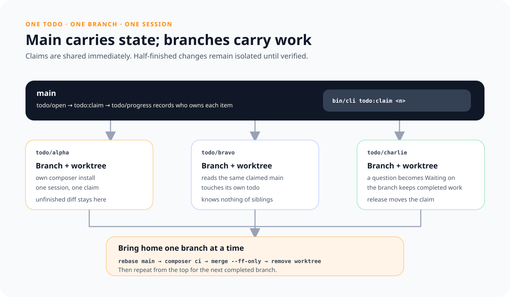

# Working several todos at once

One session works one todo, and everything about that is
[working-a-todo.md](working-a-todo.md) — unchanged here. This page is the part
around it: how several sessions get different work, where each of them writes,
and how what they wrote comes back. Nothing on it replaces the reading, the
research or the question a todo is owed.

It is worth doing where the queue holds work that does not overlap, which is
most of what accumulates here: entries that name a decision each and are read
against different parts of the checkout. It is not worth doing for two todos
about one file, and it is not worth doing for one.

## What is everybody's and what is one session's

**`main` carries the state, the branch carries the work.**

That is the whole arrangement, and every rule below follows from it. Who has
what in hand is on `main`, where all of them read it. The half-finished diff is
on a branch, where nobody else has to look at it. A question that stopped a
session comes back to `main` on its own — the branch it was asked on stays where
it is.

The reason is that `todo/` is the one thing every session writes. One todo is
one file, and that was already true before anybody worked two at once; it is
what makes this possible at all. Each session touches its own file and no other.

## Taking them on

    bin/cli todo:claim 3

**That command is the whole setup.** Three todos come out of the queue into
`todo/progress/`, each with the branch it will be worked on and today's date;
from then on `bin/cli todo:next` offers them to nobody, and the fourth session
is handed the item behind them. Then the commit that carries the claims, a
worktree apiece with its own `composer install`, and the message the three
sessions are started with. What is left to do is start them.

It carries that out rather than printing it because of the order, not the
typing. A claim has to be on `main` before the worktree is cut from it, or the
worktree carries no file saying what it was made for — and that failure surfaces
in the session, hours later, as a refusal nobody can place. Three steps that
have to happen in one order are one step.

Where a todo has been worked before, the branch it derives to and the worktree
named after it are both still there. Neither is refused and neither is reused:
the claim is given the first free name — `todo/<name>-2`, `.worktrees/<name>-2`
— and records it, because a worktree that quietly attaches to an old branch is
the one failure here that looks like success. `**Branch:**` on the claim is what
says which is which, which is what it was always for.

What it prints besides the branches is an overlap, in the three ways two claims
can have one. Nothing here knows which lines a step will touch, so all three are
a warning to read before the worktrees exist rather than a refusal.

Two claims **answering for** one entry are two sessions editing one file, and
taking one of them is cheaper than merging both. Two **naming** one class are
the same a step less certainly — a todo says where it is about to work, as a
path, as `Class::method()`, or as the bare name, and the claim resolves all
three to the file. Two **standing on** one requirement or decision without
serving it are working from a single judgement, which is where a pair of steps
that have to agree comes from.

The last two are here because `Serves:` alone missed the collision that cost the
most. On 2026-08-02 two todos with different `Serves:` lines each added a
handler for one token to one function; the rebase put them in sequence, each
ending in `continue`, and the second was never reached. Both had named
`R-ANS-012` and both had named the class — one as `Extension::describe()`, the
other as `src/Installation/Extension.php`. Neither is a declaration and neither
had to be: it is a session saying where it is going, in the file the claim reads
anyway.

`bin/cli todo:release <name>` is the way back out, for a claim nobody is working
— a branch that came home with a question left over, one that was abandoned, a
session that never started. Where it goes is read off the claim, and the branch
is left alone either way.

## The worktree

One per claim, made by `todo:claim`: a worktree on the claim's branch, its own
`composer install`, and `.checkouts/` symlinked in. What it does by hand is here
because it is what the command is doing, and because a worktree made some other
way has to do the same.

**Run `composer install` in the worktree. Never symlink `vendor/`.**

That one costs an afternoon to find. `Paths::root()` is the directory above
`src/`, and Composer's autoload map resolves `src/` from wherever the autoloader
physically sits — so a symlinked `vendor/` points every path in this repository
back at the main checkout. `bin/cli` then reads and writes the todos,
requirements and decisions of the checkout the session is not in, and nothing
about the output looks wrong.

`.checkouts/` is the opposite case and is symlinked on purpose. It is 861 MB, it
is gitignored, and a session working a todo only ever reads it. Only
`bin/cli checkouts:update` writes there, and that is not a claim's work.

## Starting the sessions

One session per worktree, started in that worktree, and all three get the same
message — the one `todo:claim` printed. It is not on this page, because a copy
here and a copy in the command are two things to keep in step and one of them
would be sent. How the session is launched at all — which build, from where,
with what switched on — is [driving-a-session.md](../driving-a-session.md), and
it is the same launch a forward run uses.

**Better: let the claim start them.** Put the command line that starts a session
on this machine into `.session-command` at the root of the checkout, and
`todo:claim` runs it once per worktree — that worktree as the working directory,
the message on standard input, `TODO_SESSION_ID` in the environment. The file is
gitignored, because how a session is launched is a property of the machine and
not of the repository, and [driving-a-session.md](../driving-a-session.md) is
where what the launch has to get right is written down. Each session reports
into `.worktrees/.sessions/<name>.log`.

That is the fourth step joining the other three, and it is here for the same
reason they are. A step left over for somebody to carry out by reading is the
one that breaks: the run of 2026-08-02 started every session in the directory
that was already open, and three worktrees stood untouched while the sessions
read a queue belonging to somebody else.

Where the file is absent nothing is started and the handover prints instead —
one absolute `cd` per worktree and the message under a line saying the rest of
the output is not part of it. Which directory a session is started in was a
sentence once, *with that worktree as its working directory*, and a property
somebody satisfies is a blank wearing prose.

**Nothing in that message is filled in**, and that is the whole of what it took
to fix. It was a template with the worktree path and the branch left as blanks,
and the run that broke sent it as it stood: the session read
`<absolute path to the worktree>` as a line it was being given rather than one
somebody had forgotten, and no check it could make would have told it otherwise.
A message with a blank in it is a message somebody fills in, so there is none —
every session is started with the same characters, and there is nothing to get
wrong.

What the message therefore cannot name is which todo is whose, and that half was
never the prompt's to answer. A path a session is handed is one it has no reason
to doubt: a worktree on a branch the claim never named — or one cut from a
`main` that did not carry the claim yet — passes every check the session can
make and then reads the queue, where it finds real work belonging to somebody
else. So it is read out of the checkout instead:

    bin/cli todo:next --worktree

The same command every session in this repository starts with, and the flag is
the sentence the prompt used to carry: *this session is one of several*.
Standing on a claim, it hands over that claim and names the branch it is
committed on. Standing on none — the wrong branch, a claim that was not on
`main` yet, or a session started in the main checkout at all — it says which of
those it is and stops. Where it refuses, that is the end of the session and not
a cue to find something else to do.

## What the session does with it

Nothing about it is special. It reads what the todo serves, settles what the
step turns on, and leaves the file true — all of
[working-a-todo.md](working-a-todo.md), which the command names as usual.

Four things are different, and all of them are consequences of `main` being
elsewhere. The claim is handed over with them attached; this is why they are
there:

- **Commit on the branch, never on `main`.** That includes the todo file itself.
  A finished claim is a deletion in the branch, and the merge is what carries
  it.
- **Leave the group listings alone** — the block at the foot of a
  `requirements/<group>/readme.md` or `decisions/<group>/readme.md`. It is
  generated from every file in the group, and a worktree can only see its own
  new entry. That means the command, `bin/cli requirements:index` or
  `bin/cli decisions:index`, and it means the line: two sessions editing one
  listing by hand conflict where two sessions leaving it alone do not. The
  session that merges runs both commands once, and `requirements:check` says so
  if it forgets. Nothing in `composer ci` says it, deliberately: a suite that
  held the listing would fail every branch that adds an entry, on the one line
  the branch is told not to touch — `D-FBK-011`.
- **Say nothing about what another branch has done.** A sibling's state is the
  one fact a worktree cannot check, and writing it down is how a run of ten
  leaves two feedback answering for nothing. Twice now the same sentence has
  been written by both halves of a pair — *the feedback stays open behind the
  sibling todo, which is another session's claim* — and both times the sibling
  was finished. Each session was right about its own half and wrong about the
  half it could not see. What is true instead is shorter: this half is done, and
  whether the entry closes depends on the other, which was not read here.
  `TodoTest::everyOpenFeedbackIsOnTheBoard` is what catches the leftover, on the
  rebase, once both halves are on `main`.
- **Point at entries, not at positions.** In a file two sessions are both adding
  to, *above*, *below*, *once*, *the first* and *the other* are all claims about
  a layout that has one more section in it by the time anybody reads them. The
  run of 2026-08-02 wrote *this entry has been cited once* into an entry that
  ended the day with three citations, *the paragraph above* into one that gained
  three sections in between, and *the **Wrong if** got its other answer* twice,
  in two accounts that could not both be the other. Name the feedback, the
  requirement or the decision instead: those survive whatever lands beside them.

## A question that arrives mid-work

A todo that turns out to need an answer nobody here can give is the normal case,
not the exception, and a session working alone asks and waits. One of several
cannot: waiting blocks a worktree on a person who is answering three others.

So it does not ask, it records. The question goes into a `**Waiting on:**` line
on the claim in `progress/`, in the words it would have been asked in, together
with what the reading already established. Then the session commits what it has
and ends. The branch keeps the half that is done.

What happens next depends on whether the work behind the question stands on its
own. Most of the time it does — the session settled one half of its todo and the
question is about the other — and then the branch merges like any other and the
trimmed claim comes with it. Where it does not, only the claim comes back:

    git checkout <branch> -- todo/progress/<name>.md

That keeps `main` free of a half-finished change while still saying, in one
place, what is open and where the work behind it is.

**A claim whose branch is gone does not stay in `progress/`.** That state is for
as long as a branch is live. Once the work is merged and the branch deleted,
`**Branch:**` names something nobody can look at, and the todo is blocked on a
person — which is what `waiting/` is. `bin/cli todo:release` reads that off the
claim: one carrying a `**Waiting on:**` goes to `waiting/`, one carrying none
goes to the end of the queue. Neither touches the branch.

A claim in `progress/` with no `**Waiting on:**` and an old `**Claimed:**` is
the other thing to look for. Nobody is working it, and nothing will notice on
its own — `bin/cli todo:list` prints the date for exactly that reading.

## Bringing the branches home

**A run that is finished comes home now.** Checked, merged, worktree gone — and
none of it waits for the sessions still going. Nine branches held back until the
tenth reports are nine that each need a bigger rebase when they finally move,
against a `main` that kept going without them, and the only thing the waiting
bought was a tidier-looking moment. There is no batch here: there are ten
sequences of the same four steps, started whenever their session ends.

**One at a time, rebased onto `main` and fast-forwarded — no merge commits.**

    git -C .worktrees/<name> rebase main
    (cd .worktrees/<name> && composer ci)
    git merge --ff-only todo/<name>
    git worktree remove .worktrees/<name> && git branch -d todo/<name>

`main` moves while the sessions run, so a branch cut hours ago is behind it and
cannot be fast-forwarded as it stands. The rebase is what makes the merge a
fast-forward, and `--ff-only` is what says so: where it refuses, something is
not what this procedure assumes, and that is worth stopping for. What comes out
is one sequence of commits on `main` rather than a merge commit per claim saying
nothing but that a claim existed.

**The four steps belong to one branch, and the next branch starts them again
from the top.** `main` moved when the last merge landed, so a branch rebased
before it is behind again — running two merges from one rebase is the mistake
the run of 2026-08-02 made, and `--ff-only` caught it, which is what it is for.
And the worktree goes **after** the merge, never before: removed early it takes
the only checkout the rebase and the suite can run in, and getting it back costs
a fresh `composer install`.

**`composer ci` runs in the worktree, after the rebase.** That is the first
moment the session's work stands on what `main` has become, and it is the only
run that says anything: one from before the rebase checked a tree that no longer
exists. One at a time for the same reason — a suite that fails after three
branches says nothing about which one broke it. The claims themselves never
conflict, each session having touched one file in `todo/` and its own.

Where one branch fixes something the others are also failing on, that one goes
first. Otherwise every merge behind it is checked against a suite that was
already red, which is the one thing this order exists to avoid.

Then, once, on `main`:

    bin/cli requirements:index && bin/cli decisions:index
    bin/cli repository:check

That is something a per-branch run cannot see. The listing at the foot of a
group readme is generated from every file in that group, so entries merged from
two branches leave it short by one — `bin/cli requirements:check` says so and
names the command, and the index commands above are that command run before it
has to.

What used to stand here as well was the queue: two sessions that each queued new
work both read the same last number and both took it. There is no number now, so
there is nothing to collide — two todos are both `normal` and the older one is
older, whichever branch each arrived on.

**An id still collides, and that is the one to expect.** A requirement and a
decision are numbered, every session reads the same last number, and ten of them
reading it at once produce duplicates: the run of 2026-08-02 wrote `D-ANS-009`
twice and `D-FBK-018` twice. Nothing can prevent it and nothing needs to —
`composer ci` in the second branch fails on *two decision files claim the same
id* once the first is on `main`, which is the rebase doing its job. Renumber the
later one, fix what names it, amend, and the check goes quiet. Whichever branch
merged first keeps the number, so the order is decided by the order the work
came home rather than by anybody arbitrating it.

**What is dangerous is the renumbering, not the collision.** Four runs of ten
produced seven of them, and twice the files naming the old number did not all
mean the same entry: `R-PRJ-008` rested on the `D-ANS-013` that kept it while
five other files meant the one that became `D-ANS-015`, and `ans-006` named the
`D-ANS-016` that stayed while a requirement and a todo named the one that became
`D-ANS-019`. A search and replace over the id is wrong in exactly those cases,
it is silent, and no check fails afterwards — the entry it now points at is
real.

    bin/cli decisions:renumber <decision>

That moves the entry and every reference whose own line names its file, and
prints the rest — the bare ones, which is what both mis-pointings were. Those
are read one at a time, and `git diff main -- <file>` is what settles an
ambiguous one: a line this branch added means this branch's entry. The list is
the whole of them, so a reference nobody read is one somebody skipped rather
than one nothing mentioned —
[`D-DOC-015`](../../decisions/documentation/doc-015-a-renumber-moves-what-a-link-path-settles-and-names-the-rest.md).

**A marker that survives the resolution is what nothing used to catch.** A file
with a `>>>>>>>` left in it parses, lints, and passes every test that does not
happen to read it; the run of 2026-08-02 put one into a decision and
`composer ci` went green over it, in a commit whose diff looked deliberate.
`StructureTest::noFileCarriesAConflictMarker` reads every file this repository
keeps, so the suite the branch already runs after its rebase is where that now
surfaces.

**Two sessions can also land on one entry** where nothing declared it: the
overlap `todo:claim` reports is read off what the todos say, and this one is
created by the judging rather than written down before it. Two of the ten judged
different feedback into the same `D-SKL-001`, which the rebase surfaced as a
conflict in the file. Usually both paragraphs belong — each is an account of one
reading, which is what a **Since then** carries, so the resolution is a heading
each rather than a choice between them.

**A claim left in `progress/` is released here**, and it is the one thing the
merge does not carry. The session that ended on a question left its claim there
on purpose — the branch was live and held the half that is done — and deleting
that branch is what turns the same file into a lock on a todo with nothing
behind it. `bin/cli todo:release <name>` moves it to `waiting/`, where the
question is what it is now blocked on, and `bin/cli todo:check` reports a claim
whose branch is gone so that forgetting costs a line rather than a todo.
