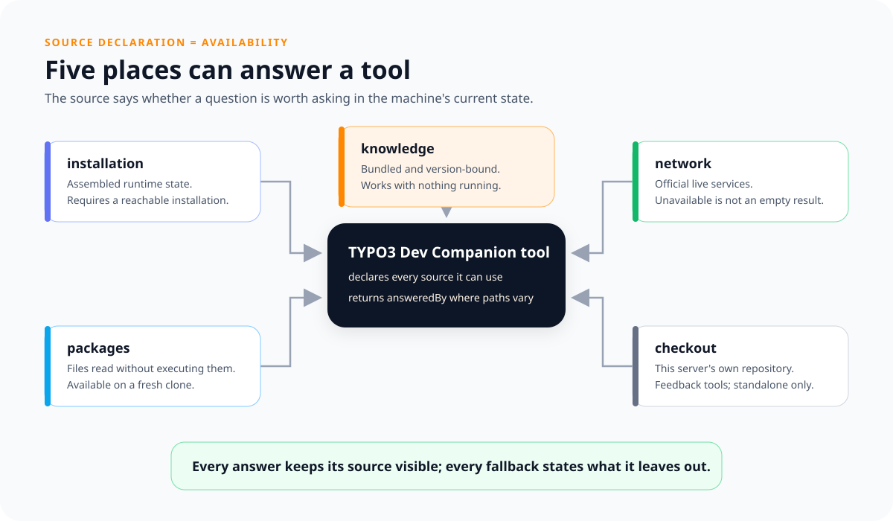

# Where an answer comes from

Every tool declares which sources can answer it, and says so at the foot of its
own description and on its page here. What that answers is not what a tool is
about but whether it can be asked at all right now: with nothing running, the
tools under knowledge and packages are the ones still worth calling. Which
source answered one call is `answeredBy` in that answer, where the tool has two.
This page is written by `bin/cli tools:index` from the Source enum.

## installation

The installation this server was started in, booted or asked through its
console: its assembled state after every extension has had its say, and nothing
at all where it cannot be reached.

[`typo3_server_scope`](typo3_server_scope.md),
[`typo3_label_lookup`](typo3_label_lookup.md),
[`typo3_fluid_namespace_list`](typo3_fluid_namespace_list.md),
[`typo3_configuration_lookup`](typo3_configuration_lookup.md),
[`typo3_schema_lookup`](typo3_schema_lookup.md),
[`typo3_backend_module_lookup`](typo3_backend_module_lookup.md),
[`typo3_icon_lookup`](typo3_icon_lookup.md),
[`typo3_extension_scope`](typo3_extension_scope.md).

## packages

The files the installed packages ship, read rather than executed. Answers on a
fresh clone and with the containers down; what a package registers by running is
not in it.

[`typo3_component_lookup`](typo3_component_lookup.md),
[`typo3_label_lookup`](typo3_label_lookup.md),
[`typo3_fluid_namespace_list`](typo3_fluid_namespace_list.md),
[`typo3_icon_lookup`](typo3_icon_lookup.md),
[`typo3_changelog_lookup`](typo3_changelog_lookup.md),
[`typo3_project_scope`](typo3_project_scope.md),
[`typo3_extension_scope`](typo3_extension_scope.md),
[`typo3_catalog_scope`](typo3_catalog_scope.md).

## knowledge

The knowledge base inside this package. Needs nothing running, and is bound to
TYPO3 versions rather than to an installation.

[`typo3_server_scope`](typo3_server_scope.md),
[`typo3_rule_lookup`](typo3_rule_lookup.md),
[`typo3_script_lookup`](typo3_script_lookup.md),
[`typo3_task_guide`](typo3_task_guide.md),
[`typo3_test_run_guide`](typo3_test_run_guide.md),
[`typo3_hint_lookup`](typo3_hint_lookup.md),
[`typo3_component_lookup`](typo3_component_lookup.md),
[`typo3_system_extension_lookup`](typo3_system_extension_lookup.md),
[`typo3_reference_list`](typo3_reference_list.md),
[`typo3_translation_domain_lookup`](typo3_translation_domain_lookup.md),
[`typo3_catalog_scope`](typo3_catalog_scope.md),
[`typo3_commit_message_guide`](typo3_commit_message_guide.md).

## network

A service outside this machine. An unreachable one is said out loud rather than
answered as empty.

[`typo3_documentation_lookup`](typo3_documentation_lookup.md),
[`typo3_forge_lookup`](typo3_forge_lookup.md),
[`typo3_gerrit_lookup`](typo3_gerrit_lookup.md).

## checkout

This server's own checkout, which is why the tool offering it exists only in a
standalone one.

[`typo3_feedback_record`](typo3_feedback_record.md),
[`typo3_feedback_list`](typo3_feedback_list.md).
