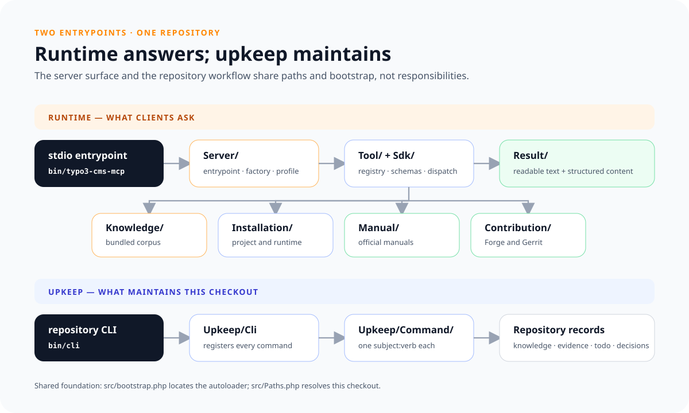

# Working on the server itself

For someone changing this repository rather than using it. The conventions are
in [AGENTS.md](../AGENTS.md); these are the commands they rest on.



## Keeping the repository in order

Everything this repository is kept in order by is one command — the requirement
and decision files, the forward-run scenarios, the hint corpus, the bundled
catalogs, and the core checkouts below. Run it with nothing and it says what it
supports:

```bash
bin/cli                   # every command it carries, grouped by subject
bin/cli todo:next         # the one todo that is due now, and nothing else
bin/cli repository:check  # requirements, decisions, scenarios and the todos against their formats
bin/cli help <command>    # what one command takes, and what each argument is
```

`bin/typo3-dev-companion` is the server itself and carries none of this.

## Core checkouts

The knowledge is bound to TYPO3 versions, so writing it means checking a
statement on both sides of the boundary it claims. `knowledge/versions.json`
declares the lines that are covered, and one command turns them into checkouts
this repository owns:

```bash
bin/cli checkouts:update   # create what is missing, update what is there
bin/cli checkouts:status   # what exists, at which revision
```

They land below `.checkouts/`, which is gitignored — one treeless clone plus a
worktree per version, so four lines share one object store (under a gigabyte in
total). Nothing at runtime reads them: they are how the knowledge is verified,
not where the answers come from.

The same command keeps `typo3/testing-framework` there, because the harness a
project extension tests in releases on its own cycle and the core repository
does not contain it (`D-KNW-002`). Which release line belongs to which major is
not recorded anywhere: each covered branch pins it in its own `require-dev`, and
one worktree per pinned line is checked out at that line's newest tag. So a
statement about the harness is verified in `.checkouts/testing-framework/<line>`
the way a statement about the core is verified in `.checkouts/<branch>`, and
`bin/cli catalog:check` re-reads both.

## Scenario environments

A case is only meaningful in the working directory it names, and two of the five
`scenarios/readme.md` defines are made by this checkout rather than found on the
machine:

```bash
bin/cli environment:status             # which ones this checkout has, and which are missing
bin/cli environment:create E-SITE      # a DDEV project with TYPO3 installed in it
bin/cli environment:create E-SITE 13.4 # the same, on another covered version
bin/cli environment:create E-NONE      # a directory with no installation above it
```

They land below `.environments/`, which is gitignored. `E-SITE` is six `ddev`
commands: a TYPO3 project, its containers, TYPO3's own base distribution at the
version asked for, the system extensions this server's console path asks for,
and the setup that writes the database, the admin user and a site configuration.
Minutes on a cold Composer cache, seconds on a warm one, and running it again
finishes one that stopped halfway.

There is one installation per covered version, each its own directory and its
own DDEV project, and the version named none is the covered stable one. Asked
for one that is already installed the command starts its containers rather than
building anything, so an environment is made once and kept — `D-EVI-006`, which
also has what one costs on disk.

The development line is one of them and is built differently: from the base
distribution's `dev-main` at a dev stability, on PHP 8.5, because that is what
its core declares. It is the only line on which this server's answers about the
next major can be seen at all, and it moves under the machine daily — nothing
re-makes it, so `ddev delete` and `create` again is what refreshes it.

What it is for is a directory in which `ddev exec vendor/bin/typo3 …` answers —
the half of this server that no test reaches, and where both `D-DIS-007` and
`R-DIS-018` were found by a real run instead. What it is not for is a recorded
forward review: a scaffold's defects are this repository's own, so a review
still runs in a real project. The other three environments say where they come
from when you ask for them, and the reasoning is `D-EVI-004`.

## The published documentation

This directory is published as a site, and the root `readme.md` with it, as the
page the site opens on — a visitor is a user before they are a contributor, and
this map is a page below that one. Nothing else in the repository is published.
What is generated is a copy rather than these files:

```bash
bin/cli documentation:render          # the whole site, into .site/html
php -S localhost:8000 -t .site/html   # read it at http://localhost:8000/
```

The render is one command because its steps have one order and no choice in it:
the renderer and the theme's packages installed where the checkout has none, the
stylesheet and the script built before the layout reads their hashed names, the
copy written, rendered, and the assets and the search index put beside the
rendered pages — which is where they have to be written, because the renderer
copies an image a page names and nothing else. Each step is printed as the
command a person could have typed, and a failure quotes it in full.

The site is read over a server rather than by opening `.site/html/index.html`:
the search fetches its index as a file beside the pages, and a browser refuses
that fetch over `file://`. Everything else on the page survives it, so a site
opened from disk looks whole and has no search. `documentation:render` ends by
printing that line.

87 of the links here point at a decision, a requirement or a class, and a
visitor of the site has none of those. The copy turns each of them into the file
on GitHub and leaves the rest as written, so these pages keep the paths a reader
of the checkout follows. It also publishes every `readme.md` as the `index.md` a
generator serves as the directory itself — this one as
`how-the-work-is-done.md`, since the front page is the readme — and drops the
heading a link names in another page, which this renderer answers by discarding
the link. What that costs is `D-DOC-017`, and what the site opens on is
`D-DOC-018`.

The renderer is phpDocumentor Guides, configured in `guides.xml` and installed
from a manifest of its own — `build/guides/composer.json` says why it is not in
this package's `require-dev`. The look is this repository's, in one file:
`build/guides/theme/structure/layout.html.twig` shadows the layout the renderer
would otherwise use, links the two built files by the names it reads from their
manifest, and builds the sidebar from the documents the renderer knows: a bar
across the top with the name and what opens the search, then the front page,
then the pages belonging to no subject, then each subject as a fold that is shut
unless the page being read is inside it.

The stylesheet and the script are `theme/assets/site.css` and
`theme/assets/site.js`, built by `theme/assets/build.mjs` into two files every
page links. Inlined into each page they had grown to a third of everything the
site serves — `D-DOC-019`, which also has why the name carries a hash.

Three things the renderer does not do come from that script. It colours a fenced
block in `json`, `yaml` and `bash` — the three this corpus writes — using
highlight.js with those languages registered and no other, on this theme's own
palette rather than a stylesheet of its own. It writes the button that copies a
block, since half of what is written here is a command to run. And it carries
the button that puts the page in light or in dark, or back to what the machine
says. Both that and the copy button come from the script rather than the markup,
so a browser without a clipboard carries no button that does nothing, and one
without the script keeps every block as it was written.

The colours are one set of `light-dark()` pairs and `color-scheme` is what picks
between them — the same declaration a browser needs to stop drawing the
scrollbars and the search field light on a dark page. So what the button writes
is one attribute on `<html>`, and the head reads the stored one before the page
paints, since a deferred script would show the other theme for a frame.
`.github/workflows/documentation.yml` runs all of it on every push to `main` and
deploys the result to
[GitHub Pages](https://benjaminkott.github.io/typo3-dev-companion/). It needs
`Settings → Pages → Source: GitHub Actions` on the repository: a deployment from
a branch serves the root or `/docs`, and this directory is neither.

The search is this repository's too, because the renderer has none. `Site`
writes one entry per page — its URL, its title, its headings and its prose — and
the script filters it in the reader's browser, fetched when the search is first
opened and not before. Fenced blocks are left out: 582 of them, mostly a
recorded tool answer in JSON, which is what keeps the index at 213 KB rather
than a megabyte and a prose match above the evidence.

What the reader sees is a dialog, opened with the button in the bar or with
Ctrl-K, and the arrows and the return key move through the hits and open one —
`D-DOC-021`.

## Tests

```bash
composer ci      # lint, coding guidelines, static analysis, tests — what CI runs
composer test    # phpunit only
composer stan    # phpstan only
composer cgl     # bring every PHP file to the guidelines; cgl:ci only reports
```

`composer ci` lints, checks the coding guidelines, runs the static analysis, and
runs the test suite: the search and ranking logic, every tool against its
declared schemas and annotations, and the stdio entrypoint driven as a real
subprocess. CI runs the same command on every supported PHP version.

The guidelines are php-cs-fixer's, configured in `.php-cs-fixer.dist.php` and
nowhere else: PER-CS 3.0 plus the handful of rules this repository writes by —
strict types declared, imports sorted with global classes left unimported,
single quotes, trailing commas in multiline arrays. `cgl` rewrites the files and
`cgl:ci` reports what it would rewrite, which is the half `ci` runs because a
check may not change the code it is judging.
