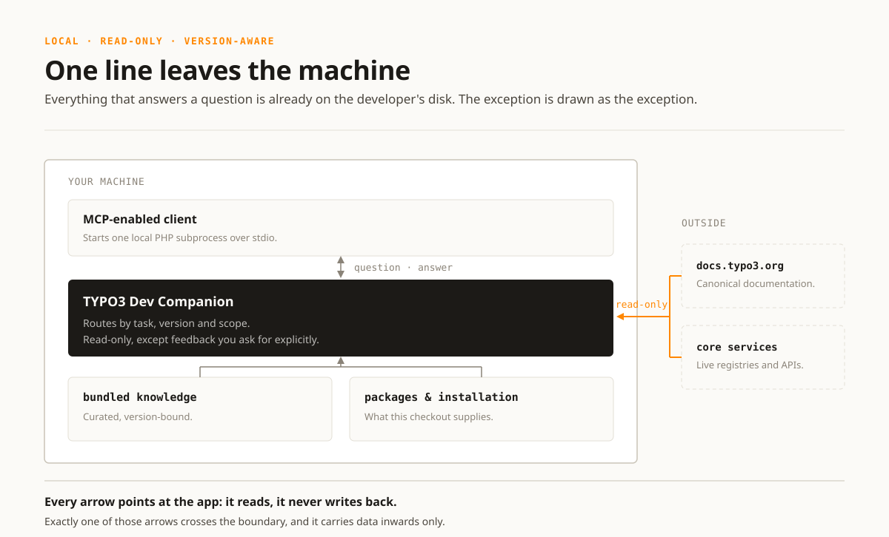
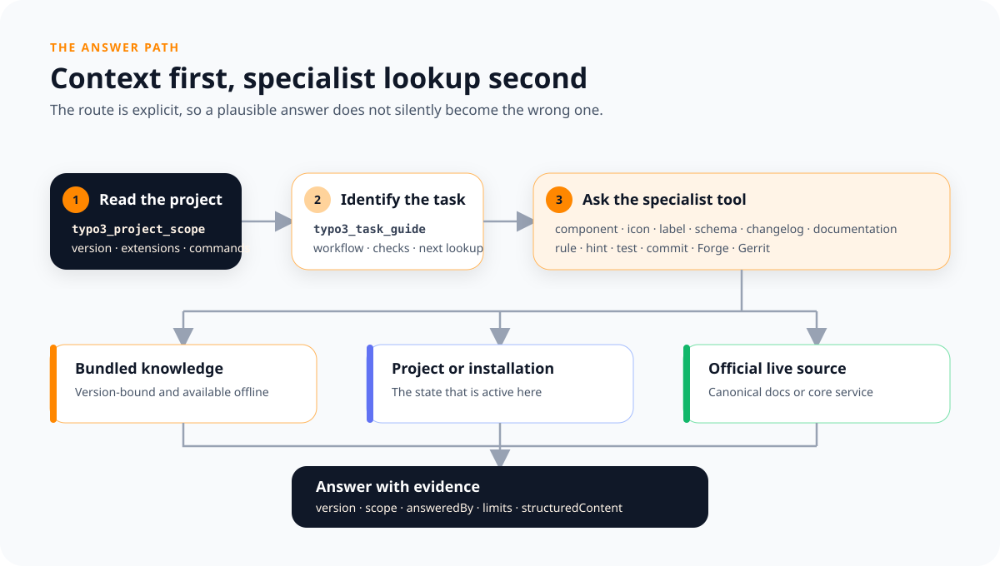
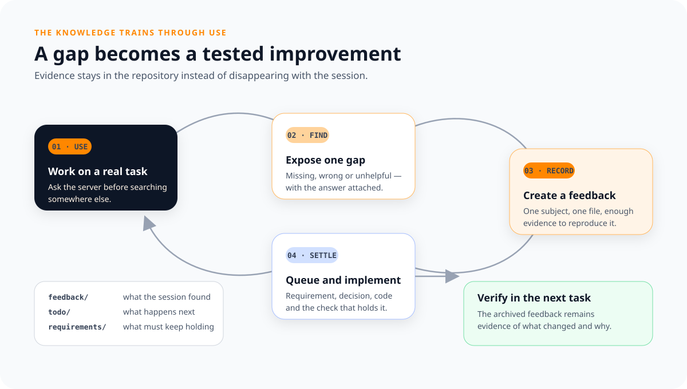

# TYPO3 CMS MCP

A local MCP server (plain PHP) that helps coding agents implement, review and
verify TYPO3 work for the three audiences that do it: the core contributor, the
extension author and the site developer. It establishes the project and
installation the agent is working in, supplies current, version-bound TYPO3
knowledge, and hands task-specific workflows to the skills that own them.

Scope answers describe what is present without treating it as correct. The
knowledge and skills supply the conventions that apply, so code found in one
installation is not repeated as a pattern merely because it runs. They cover how
TYPO3's subsystems are used, the core's own contribution process, and a catalog
of backend UI components: context otherwise spread across project files, core
conventions and the official documentation.



**It answers from three sources.** Almost everything comes from the bundled
`knowledge/` files, which are bound to versions: a statement that does not hold
on every covered TYPO3 line carries the ones it does. Broad API, reference and
tutorial questions are searched in the official live TYPO3 documentation
instead, with the requested release and canonical source on every result. And
some questions have no bundled answer that could be right — which labels exist,
which icons are registered, what a configuration value is after every extension
has had its say. Those are properties of an installation, so the server finds
the one you are working in and asks *it*, through its own console or by booting
it in a subprocess of its own.

**It answers before the installation does.** The bundled knowledge needs nothing
running, and that is the state much of it is asked in: a project that does not
exist yet, an upgrade that left the site unbootable, a core checkout with no
database. Where a question is about the installation itself, that installation
is booted through its own interpreter, in its own container where it runs in
one. Where it comes up without its essential configuration it holds core
packages only, and every registry in it answers with a subset that looks like
the whole — so that state is named rather than passed on as an answer. Where it
does not come up at all, the packages are read instead, and every answer carries
which of the two it came from and what that leaves out.

**It is queried in English**, whatever language the user is speaking. The
knowledge is written in English and the matching is lexical, so a query in
another language reaches only the technical loanwords the two share. The agent
translates the subject before calling and the answer back afterwards; the server
states this in the instructions it sends at initialize and in
`typo3_server_scope`.

**It supports the patch without writing it.** The coding agent keeps the
checkout: which files changed, which branch it is on and which tests cover them
are read there. The server supplies what the work needs around that reading:
which conventions govern a concrete path, which markup, icon identifier and XLF
resource have to be literally right, which deprecation lands in between, which
check the change has to survive, and what the commit message says.

**The conventions are the core's own**, and several of them have no counterpart
in a project or an extension — the changelog, the Gerrit workflow, the core
testing suites. So the answers say which repository they are for, worked out
from structure rather than from wording. What transfers is still answered; what
only the core has is left out with the reason. The tools are not: every client
is offered all of them, because whether a task is core work is a property of the
task and the tool list cannot vary per task.

**Those files are trained by being used.** An agent gets a real task in a real
checkout and works under one rule: whatever it would otherwise search for, it
asks this server first. Where the server answers, that answer is what the task
is done from. Where it does not, the agent solves the task on its own — and that
is the half worth something, because the agent now holds an answer the knowledge
base did not have. So the session ends by handing it back, and a gap found that
way arrives with its answer attached. That is also what decides what gets built
next: what this server does not answer yet is mostly what no session has handed
back yet, and a boundary is the other thing and is stated as one in
`typo3_server_scope`. See [Improvement feedback](#improvement-feedback).

It is built on the official [`mcp/sdk`](https://packagist.org/packages/mcp/sdk)
and speaks **stdio** (`bin/typo3-cms-mcp`): the MCP client launches it as a
subprocess, so there is no server to host, no network exposure, and no auth to
configure — the process boundary is the trust boundary. Request serving is
read-only apart from the explicit feedback tool, and setup writes only when
asked. Nothing on your machine is started as a side effect of a lookup: a
stopped DDEV project is reported with the command that would fix it.

## Quickstart

Requirements: **PHP 8.2+** and Composer. The package works both ways — as a
standalone checkout and as a Composer dependency of another project.

```bash
# standalone: clone, install once, then point a project at it
composer install
/absolute/path/to/typo3-cms-mcp/bin/typo3-cms-mcp install

# as a dependency: from the consuming project's root
vendor/bin/typo3-cms-mcp install
```

`install` writes the `typo3-cms-mcp` entry into the project's `.mcp.json`,
leaves every other entry alone, and publishes the task skills to
`.agents/skills` — the two locations a client finds without being configured for
it. `--agent=<id>` writes them where that client actually reads them instead.
Either way the setup is recorded in `.typo3-cms-mcp/state.json`, so a later
`update` refreshes all of them without being told which. Every directory the
package writes carries its own `.gitignore`, so nothing has to be added to the
project's — and the skills the project wrote itself stay visible beside them.
The knowledge base ships inside the package, so nothing else needs to be
deployed or configured.

Codex, Claude, Cursor, Copilot, Zed and eight more clients, DDEV projects where
the server has to start inside the container, the generated `.mcp.json` shapes,
and the two environment variables that end a failed discovery:
[documentation/clients/installing.md](documentation/clients/installing.md).
Changing this repository rather than using it:
[documentation/working-on-the-server.md](documentation/working-on-the-server.md).

## Tools

Every tool answers twice: the readable text, and the same answer as
`structuredContent` matching the `outputSchema` the tool declares — matches with
their source, coverage and score, checks as command strings, components, icons
and labels as typed records, commit diagnostics as `level`/`code`/`message`. So
composing several tools does not mean parsing headings and code fences back out
of prose. All tools are annotated `readOnlyHint`; only `typo3_feedback_record`
writes anything, and then only a new file.

Names are `typo3_<subject>_<verb>`, with the verb taken from a fixed set —
`lookup` finds and may find nothing, `guide` composes an answer for a task,
`list` enumerates, `scope` states what a source covers, `describe` states what
one thing you name is, `record` writes. So the name already says what shape the
answer has.

Every tool also declares which sources can answer it, and says so at the foot of
its own description: the installation, the files its packages ship, the bundled
knowledge, a service over the network, or this checkout. That is what says
whether a question can be asked at all in the state the machine is in —
`typo3_server_scope` groups the tools by it, and
[Where an answer comes from](documentation/tools/answer-sources.md) is the same
statement read as a page.

What one is for, what it takes and the fields it answers with is written out per
tool in [documentation/tools/](documentation/tools/readme.md) — one page per
tool, rendered from the classes rather than kept beside them, and each carrying
what that tool answered when it was last recorded. Below is the same surface
grouped by where an answer comes from.



- **Orientation.** `typo3_server_scope` says what this server covers and at
  which depth, what it deliberately does not, and which tool to call when. It
  also names any tool the caller excluded, so a shorter list than this one has a
  reason a client can read. The place to start when it is unclear whether a
  question can be answered here at all.
- **The bundled knowledge.** The core's conventions, its contribution process
  and the checks a patch has to survive: `typo3_rule_lookup`,
  `typo3_hint_lookup`, `typo3_script_lookup`, `typo3_task_guide`,
  `typo3_test_run_guide` and `typo3_commit_message_guide`. The curated catalogs
  answer from here too — the backend UI components, the extensions the core
  ships, the worked examples it ships of its own conventions, and the
  translation domain an XLF path resolves to: `typo3_component_lookup`,
  `typo3_system_extension_lookup`, `typo3_reference_list` and
  `typo3_translation_domain_lookup`, with `typo3_catalog_scope` for which core
  revision they were taken from.
- **The installation you are working in.** What no bundled answer could be right
  about, because it is a property of the packages and the version that are
  active: `typo3_project_describe`, `typo3_extension_describe`,
  `typo3_label_lookup`, `typo3_icon_lookup`, `typo3_backend_module_lookup`,
  `typo3_fluid_namespace_list`, `typo3_schema_lookup`,
  `typo3_configuration_lookup` and `typo3_changelog_lookup`. Where the
  installation cannot be booted the packages are read instead, and the answer
  says so and what it leaves out.
- **The official documentation.** `typo3_documentation_lookup` searches the
  public tables of contents on `docs.typo3.org` for an explicitly requested
  covered release, and reads a result it returned as text.
- **The core's own services.** `typo3_forge_lookup` reads an issue and its
  comments before a patch is written for it, and answers the backlog it came out
  of — what stands open, oldest or longest untouched, in one area named in your
  own words. `typo3_gerrit_lookup` answers whether a patch for it exists
  already. Reading only: voting, uploading and amending stay with the caller's
  git and the web UI.
- **This server itself.** `typo3_feedback_record` records what was missing,
  wrong or unhelpful about an answer, and `typo3_feedback_list` reads those
  back, open ones and archived ones. Both exist only in a standalone checkout,
  see [Improvement feedback](#improvement-feedback).

## Resources

- `typo3://guides`: knowledge index — the server's scope and routing, plus every
  document and skill it serves.
- `typo3://guides/{documentId}`: Markdown resource for a single knowledge
  document, for example `typo3://guides/core/contribution/rules`.
- `typo3://skill/{skillId}/SKILL.md`: one published task workflow, for example
  `typo3://skill/typo3-extension-testing/SKILL.md`. `install` writes the same
  files into the client's own skills directory; this is the route for a client
  that never ran it.
- `typo3://skill/{skillId}/references/{file}`: what that workflow hands over at
  a step, at the path its own text links to it by — `references/base.md`
  included, which exists as a file only once a skill is published. A resource
  template rather than a listed resource: it is followed from the workflow, not
  picked out of the list.

## Knowledge base

Everything the tools and resources answer from lives in `knowledge/`:

- `documents/` — the prose corpus `typo3://guides/{documentId}` serves and
  `typo3_rule_lookup` searches: `core/contribution/rules.md`,
  `core/testing/scripts.md`, `core/contribution/commit-messages.md`,
  `core/contribution/gerrit-workflow.md`,
  `core/contribution/sources.md`
- `hints/` — one file per subject: `datahandler.json`, `fal.json`,
  `labels.json`, `site-sets.json` and many more. Each entry names the domains it
  is asked from in its own `domains` field, so the file says what the hint is
  about and the tag says which query reaches it
- `catalog/` — the component catalog (`components.json`,
  `component-checklist.json`, `references.json`, `meta.json`) and the shipped
  system extensions (`system-extensions.json`)
- `test-suite-hints.json`, `task-intents.json`, `icon-concepts.json`,
  `server-scope.json`, `versions.json`

All knowledge files are read fresh on every request, so editing them takes
effect immediately — no restart or rebuild.

Useful upstream sources:

- TYPO3 Core Contribution Guide:
  https://docs.typo3.org/m/typo3/guide-contributionworkflow/main/en-us/
- TYPO3 Core Commit Message Rules:
  https://docs.typo3.org/m/typo3/guide-contributionworkflow/main/en-us/Appendix/CommitMessage.html

## Improvement feedback

What an agent hands back at the end of a task is recorded through
`typo3_feedback_record`, and every feedback becomes its own markdown file under
`feedback/`; `typo3_feedback_list` reads them back, newest first. A feedback is
closed by the commit that implements the improvement, which moves it to
`feedback/archive/`, so `feedback/` only ever holds open items.
`typo3_feedback_list` with `status="closed"` reads the archive with the commit
subject that closed each one, so a gap that was already answered is not reported
a second time and one that needed a code change does not vanish.

Each feedback carries the working directory the session that left it ran in, as
`directory:` in its front matter, so a gap can be checked against the project it
was found in rather than against whatever is at hand. It is the same directory
the stdio entrypoint hands to instance discovery; a feedback left over an
endpoint that has none carries none. That directory is also why the feedback is
reported back as an absolute path: it is written into this server's checkout and
not into the project the session is in, and a relative path sent to a caller
standing somewhere else reads as a write that failed.

A feedback also carries `model:` — the model that left it, as it named itself.
Much of what arrives is about what a session did rather than about what an
answer said, and that is one model's behaviour: unattributed, two models' habits
are one undifferentiated report and neither can be worked off. The write never
fails on it, and a model that does not know its own identifier is asked to send
`unknown` rather than an invented one, so a feedback nobody can attribute says
so.

Both tools exist **only in a standalone checkout**. Installed as a Composer
dependency the package lives in `vendor/`, where anything written would be lost
on the next `composer install`; there the server stays strictly read-only and
neither tool appears in `tools/list`.



Working on this repository — layout, conventions, and how feedback is worked off
— is documented in [AGENTS.md](AGENTS.md).
